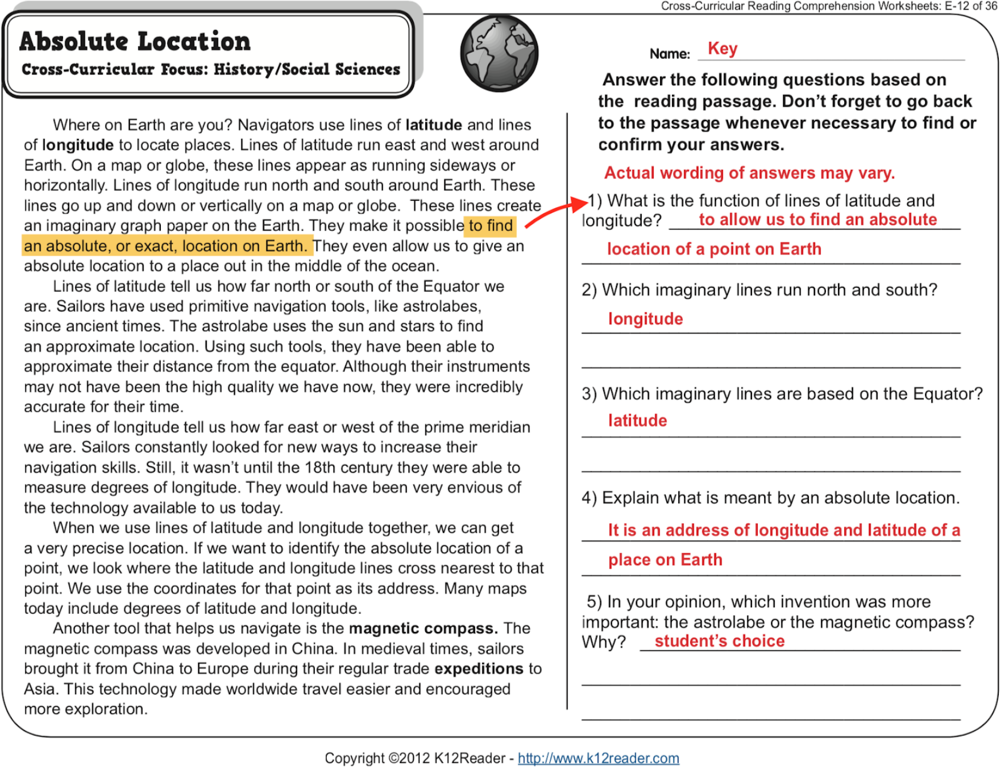
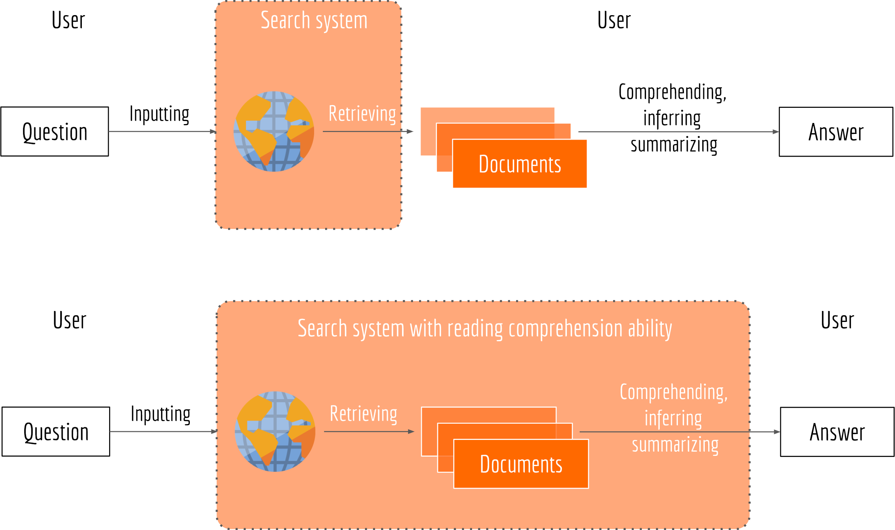
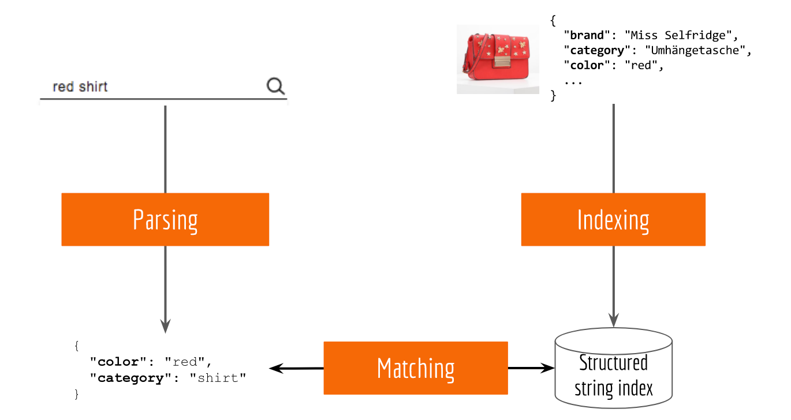
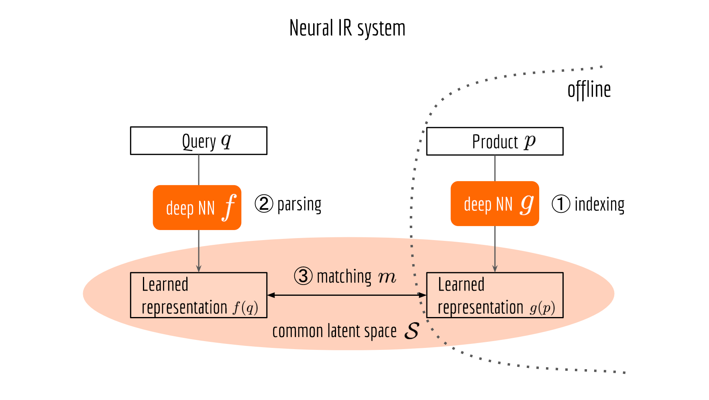

# Things To Do In NLP

Here's what we need to do everyday...these are things we practiced in school.

There is actually a bunch of tasks we need to do that NLP is focused on right now:

* GLUE benchmarks: https://gluebenchmark.com/
  * Entailment: Given a premise sentence and hypothesis sentence, predict if the premise entails the hypothesis **MNLI**
    * [1] I decided to move to Poland
    * [2] I decided to move to Warsaw
    * Is [2] true if [1] is true?
  * Question and answer: Does one of the sentences in a paragraph answer a question **QNLI**
  * Contradiction: Does one sentence contradict another? **RTE**
  * Given a sentence with a pro-noun and other sentences, select what the pro-noun refers to **WNLI**
* SuperGLUE when regular GLUE is not enough:
  * **BoolQ**, **CB** **COPA**, **MultiRC**, **ReCoRD**, **RTE**, **WiC**, **WSC**

Sometimes these tasks are refined for specific areas, e.g., sentence embeddings:

* SentEval https://github.com/facebookresearch/SentEval:
  * Binary and multi-class classification
  * Entailment and semantic relatedenss
  * Semantic Textual Similarity
  * Paraphrase Detection
  * Caption Image Retrieval

# Search

The classic way that we still use in most places is to let the user do the hard part. Our search systems are very good at producing a smaller universe of things to look at, but we want to move some of that burden back into the application:

Here's a general search system that you might build for a ecommerce site:

Today, Parsing, Indexing and Matching are all done using a-priori rules, often hand tuned and constantly tuned over time. Entire careers can be had by fine tuning deterministic systems like this.

Part of the objective is to replace the hand-tuning  and manual steps with machine learning:

###### Image Credit

These images are from:

* https://hanxiao.io/2018/01/10/Build-Cross-Lingual-End-to-End-Product-Search-using-Tensorflow/
* https://hanxiao.io/2019/01/02/Serving-Google-BERT-in-Production-using-Tensorflow-and-ZeroMQ/
