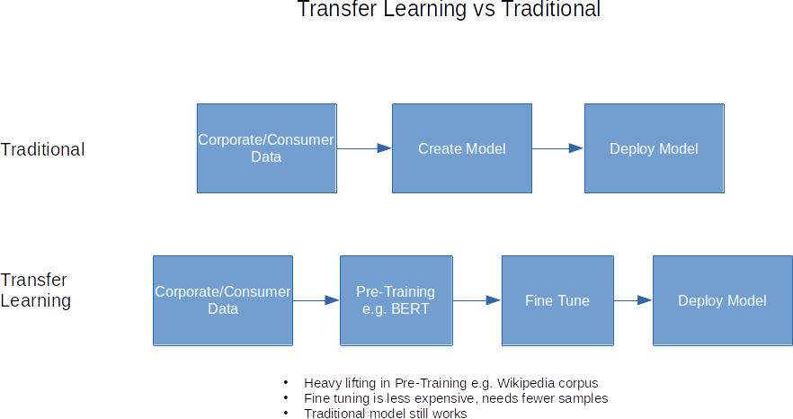

Deep learning is a technique that uses a series of models, one fed into or embedded in another model to improve learning and ultimately perform better on tasks.

While multiple models have always been used, this is a big difference and helps make it easier to leverage work down elsewhere. Transfer learning allows you to engineer a solution out of building blocks while controlling computation complexity and costs. It also enable the ability to push models building to IoT devices.

